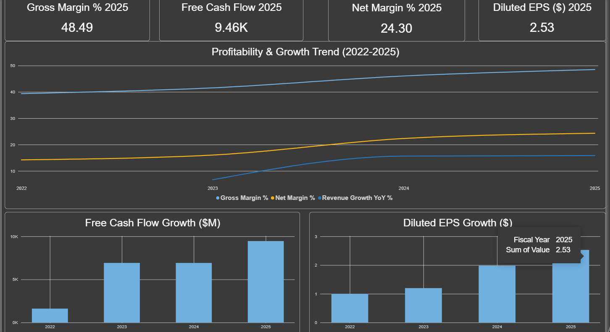

# Netflix Financial Statement Analysis (2022–2025)

## Overview

This project analyzes Netflix's (NFLX) financial performance over the last four fiscal years, tracing its transition from a period of heavy content-investment cash burn to strong, consistent profitability. The analysis combines Python for data extraction and ratio calculation with Power BI for interactive visualization.

## The Story

Between 2022 and 2025, Netflix's financials show a clear turnaround:

- **Gross Margin** improved from 39.37% to 48.49%
- **Net Margin** nearly doubled, from 14.21% to 24.30%
- **Return on Equity (ROE)** rose from 21.62% to 41.26%
- **Free Cash Flow** grew from $1.6B to $9.5B, driven largely by reduced capital intensity after the peak content-spending years
- **Debt-to-Equity** declined from 1.34 to 1.09, showing reduced reliance on debt financing

The combination of margin expansion, strong cash generation, and de-leveraging paints a picture of a company shifting from growth-at-all-costs to a more mature, profitable operating model.

## Methodology

### 1. Data Extraction (Python)
- Used the `yfinance` library to pull Netflix's historical Income Statement, Balance Sheet, and Cash Flow Statement directly from Yahoo Finance.
- Saved each statement as a separate CSV file (`income_statement.csv`, `balance_sheet.csv`, `cash_flow.csv`) for reproducibility.
- Note: Yahoo Finance's free data only exposes the last ~4 fiscal years of annual statements, which set the scope of this analysis.

### 2. Financial Ratio Calculation (Python / Pandas)
- Built a script to load the three statement CSVs and calculate a full set of financial ratios across all available years:
  - **Profitability:** Gross Margin %, Net Margin %, ROE %, ROA %
  - **Liquidity:** Current Ratio, Quick Ratio
  - **Leverage:** Debt-to-Equity
  - **Growth:** Revenue Growth YoY %
  - **Per-share & cash generation:** Diluted EPS, Free Cash Flow (Operating Cash Flow − Capital Expenditure)
- Handled inconsistencies in `yfinance` line-item naming (e.g. multiple possible labels for the same account) with a lookup function that tries several known label variants.
- Exported the final ratio summary as a single CSV (`financial_ratios_summary.csv`), formatted as metrics (rows) x fiscal years (columns).

### 3. Data Modeling (Power Query, inside Power BI)
- Imported the wide-format ratio summary CSV into Power BI.
- Used Power Query to reshape the table from wide format (years as columns) into long format (Metric / Year / Value), using **Unpivot Columns**, since long format is required for flexible filtering and charting in Power BI.
- Renamed and typed columns appropriately (`Metric` as text, `Year` as date, `Value` as decimal), and extracted a clean `Fiscal Year` column for use on chart axes.

### 4. Dashboard Build (Power BI)
- **KPI Cards:** Four cards showing the latest year's (2025) Gross Margin %, Net Margin %, Diluted EPS, and Free Cash Flow, each filtered to a single metric and year.
- **Trend Line Chart:** A multi-line chart showing Gross Margin %, Net Margin %, and Revenue Growth YoY % over time, filtered to only these three metrics to keep the scale readable (excluding metrics with very different units, like Free Cash Flow in millions).
- **Bar Charts:** Two separate bar charts for Free Cash Flow and Diluted EPS, kept on their own visuals since their scales differ too much from the percentage-based metrics to share a chart.
- Applied visual-level filters (`Filters on this visual`) throughout, rather than page-level filters, so each visual only shows the metrics relevant to it.



## Key Findings

| Metric | 2022 | 2025 | Change |
|---|---|---|---|
| Gross Margin % | 39.37 | 48.49 | +9.1 pts |
| Net Margin % | 14.21 | 24.30 | +10.1 pts |
| ROE % | 21.62 | 41.26 | +19.6 pts |
| Diluted EPS ($) | 1.00 | 2.53 | +153% |
| Free Cash Flow ($M) | 1,618.53 | 9,461.05 | +484% |
| Debt-to-Equity | 1.34 | 1.09 | -0.25 |

## Tools & Technologies

- **Python** (`pandas`, `yfinance`) — data extraction and ratio calculation
- **Power Query** — data reshaping (unpivot, type conversion)
- **Power BI** — interactive dashboard and visualization
- **Data Source:** Yahoo Finance (via `yfinance`)

## Repository Structure

```
netflix-financial-analysis/
│
├── fetch_netflix_financials.py       # Pulls raw financial statements from Yahoo Finance
├── calculate_netflix_ratios.py       # Calculates financial ratios from the raw statements
├── netflix_financials/
│   ├── income_statement.csv
│   ├── balance_sheet.csv
│   ├── cash_flow.csv
│   └── financial_ratios_summary.csv
├── Netflix_Financial_Dashboard.pbix  # Power BI dashboard file
└── README.md
```

## Author

Adham Refaat Soliman — Data Analyst | BI Analyst | AI Engineer
[Portfolio](https://adhamkhafagy.github.io) · [GitHub](https://github.com/adhamkhafagy)
